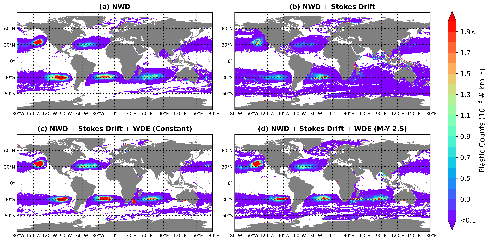

# The Role of the Unsteady Surface Wave-Driven Ekman–Stokes Flow in the Accumulation of Floating Marine Litter



This repository contains all the code used to create datasets, run simulations and analyse the work presented in the paper [The role of the unsteady surface wave-driven Ekman–Stokes flow in the accumulation of floating marine litter](https://agupubs.onlinelibrary.wiley.com/doi/full/10.1029/2021JC018106). Particle tracking simulations are performed using [OceanParcels](https://github.com/OceanParcels/parcels) library. 

If you find this repository useful, please cite our paper
```bibtex
@article{cunningham2022role,
  title={The Role of the Unsteady Surface Wave-Driven Ekman--Stokes Flow in the Accumulation of Floating Marine Litter},
  author={Cunningham, HJ and Higgins, C and van den Bremer, TS},
  journal={Journal of Geophysical Research: Oceans},
  volume={127},
  number={6},
  pages={e2021JC018106},
  year={2022},
  publisher={Wiley Online Library}
}
```